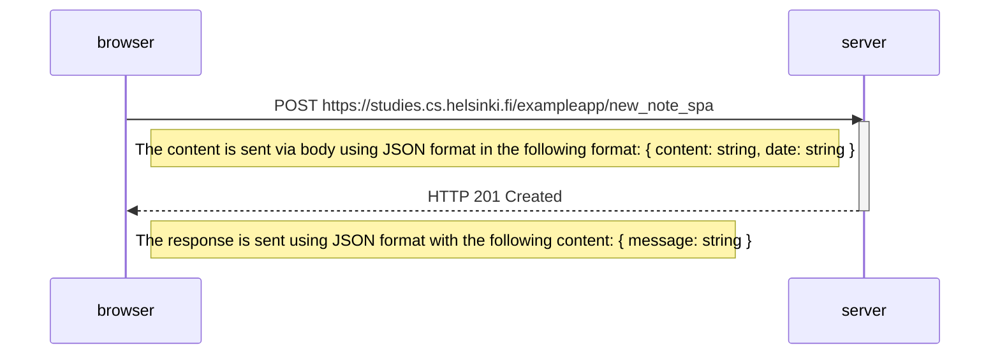

```mermaid
sequenceDiagram
    participant browser
    participant server

    browser->>server: POST https://studies.cs.helsinki.fi/exampleapp/new_note_spa
    activate server
    Note right of browser: The content is sent via body using JSON format in the following format: { content: string, date: string }
    server-->>browser: HTTP 201 Created
    deactivate server
    Note right of browser: The response is sent using JSON format with the following content: { message: string }

```